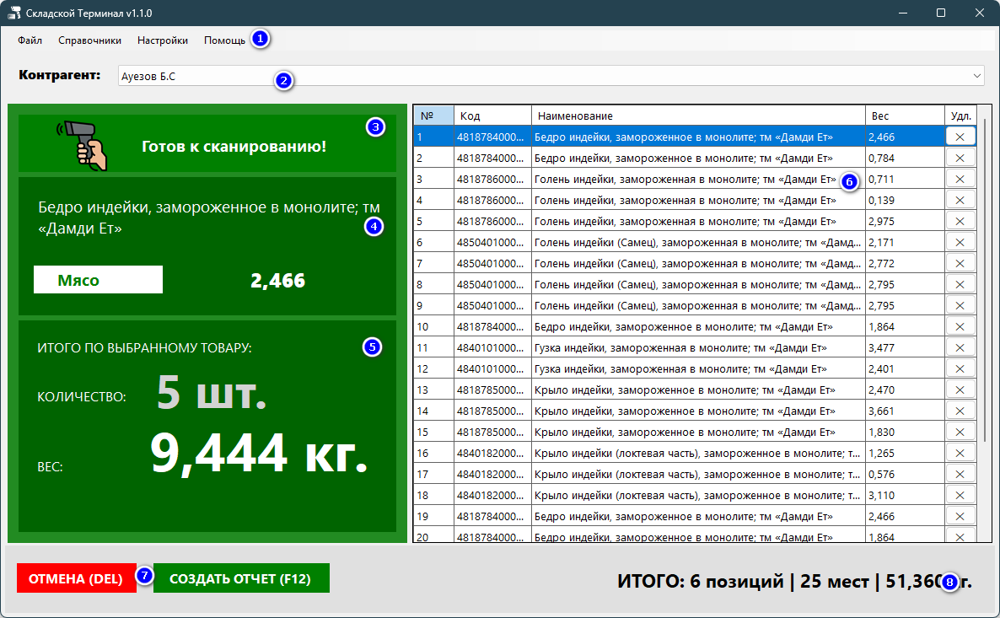
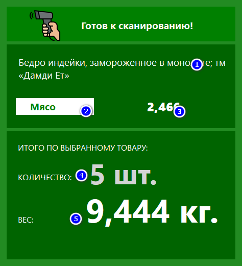
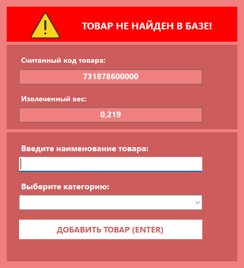

# Главное окно и элементы управления

Главное окно — это основной рабочий экран программы.  
Здесь оператор выбирает контрагента, сканирует товары, контролирует вес и формирует итоговый отчёт.

---

## Общий вид главного окна

На экране условно выделено несколько логических областей, которые описаны ниже.

---

## Верхняя панель и выбор контрагента

**Контрагент** — обязательный элемент начала работы.

1. В верхнем меню доступны пункты: `Файл`, `Справочники`, `Настройки`, `Помощь`.
2. В поле **Контрагент** необходимо выбрать получателя продукции.
3. Пока контрагент не выбран, сканирование заблокировано.

!!! warning "Важно"
    Пока контрагент не выбран, программа не принимает штрих-коды и выводит предупреждение  
    **«Выберите контрагента!»**.

---

## Информационная панель сканирования

Информационная панель отображает данные по **текущему отсканированному товару**.

1. **Наименование товара** — определяется по штрих-коду.
2. **Категория товара** — берётся из справочника.
3. **Вес текущей позиции** — автоматически извлекается из штрих-кода.

Зелёный цвет панели означает, что программа готова к приёму следующего сканирования.

---

## Итоги по выбранному товару

В нижней части информационной панели отображаются накопленные данные:

- **Количество** — сколько единиц текущего товара отсканировано.
- **Вес** — суммарный вес по выбранному товару.

Эти значения обновляются автоматически при каждом новом сканировании.

---

## Таблица позиций заказа

Правая часть окна содержит таблицу текущего заказа.

В таблице отображаются:
- номер строки;
- штрих-код;
- наименование товара;
- вес позиции;
- кнопка удаления строки (`×`).

!!! note "Примечание"
    Удаление строки из таблицы **не влияет на справочники**, а только корректирует текущий заказ.

---

## Итоговая панель заказа

В нижней части окна отображаются **итоговые значения по заказу**:

- общее количество позиций;
- общее количество мест;
- суммарный вес заказа.

Кнопки управления:
- **ОТМЕНА (DEL)** — отмена текущего заказа;
- **СОЗДАТЬ ОТЧЁТ (F12)** — формирование отчёта и завершение работы с заказом.

---

## Добавление нового товара

Если отсканированный штрих-код отсутствует в базе, открывается окно добавления нового товара.

В этом окне:
1. Отображается считанный штрих-код.
2. Показывается извлечённый вес.
3. Требуется ввести наименование товара.
4. Необходимо выбрать категорию.
5. Для сохранения нажмите **ДОБАВИТЬ ТОВАР (ENTER)**.

!!! success "Готово"
    После добавления товар автоматически попадёт в справочник и будет добавлен в текущий заказ.

---

## Типовые состояния главного окна

| Состояние | Описание |
|----------|----------|
| Готов к сканированию | Программа ожидает ввод штрих-кода |
| Выберите контрагента | Не выбран контрагент |
| Товар не найден | Штрих-код отсутствует в базе |

---

## См. также

- [Быстрый старт](../getting-started.md)
- [Справочники → Товары и штрих-коды](dictionaries/products.md)
- [Горячие клавиши](../app/shortcuts.md)
- [Решение проблем](../app/troubleshooting.md)
